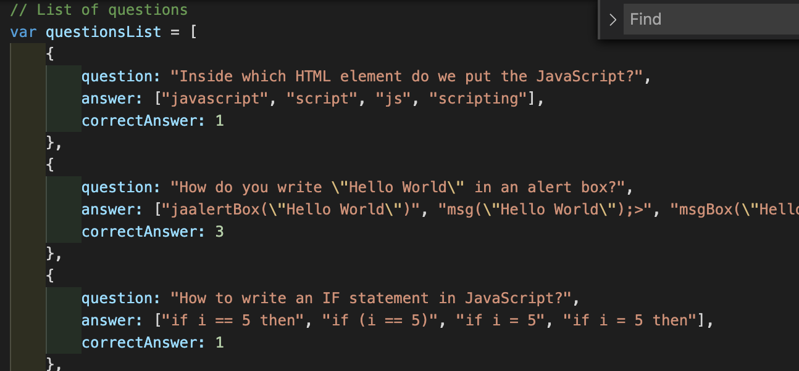
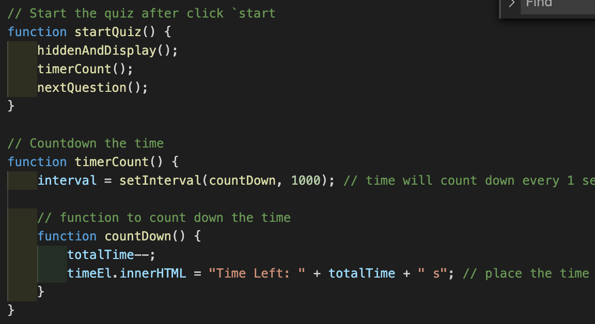
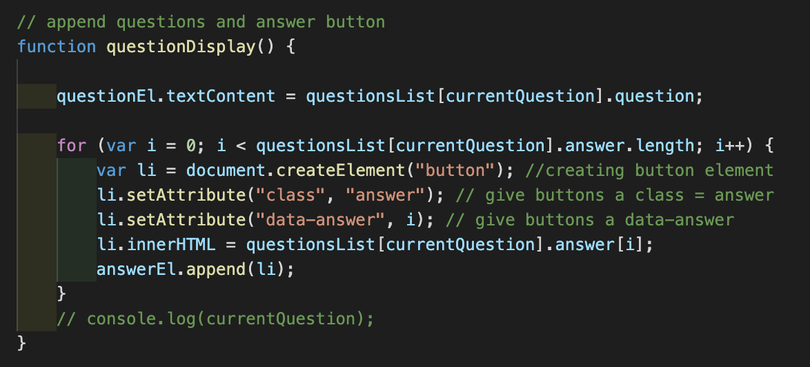
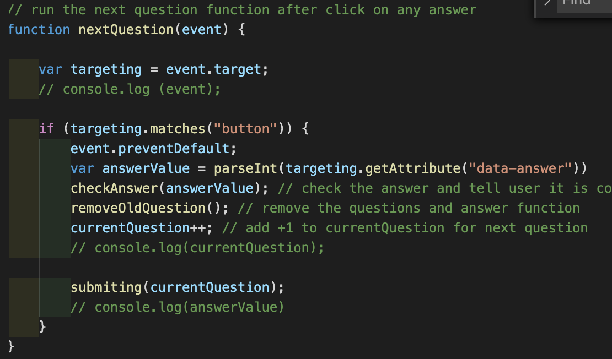
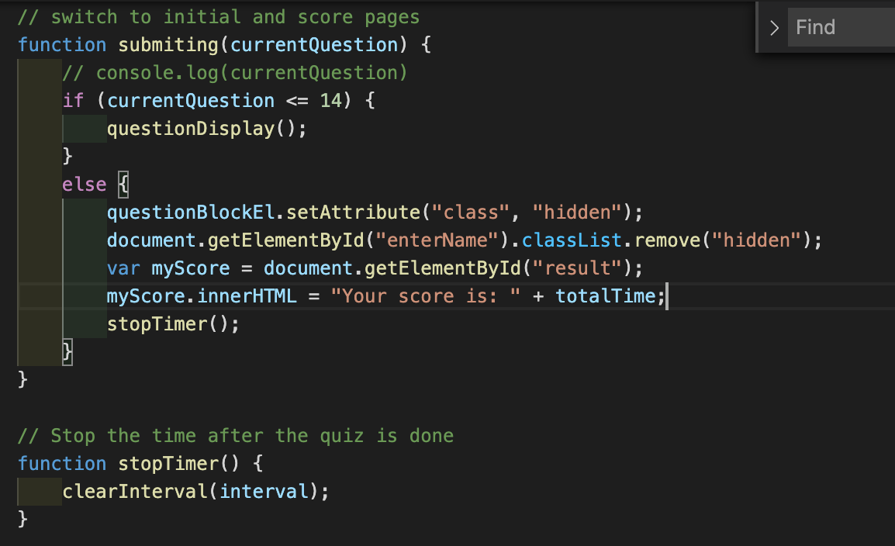
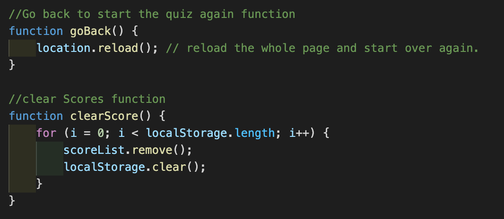

# TN-Code-Quiz-Assignment

## Task
The task of this assignment is creating a combination of multiple-choice questions and interactive coding challenges. The quiz will tell CORRECT or WRONG answer once user chose an answer. The quiz will have limited time to do the quiz. Time will be count down. Whatever time left will be your score. The higher number of time is the better score.  

At the end of the quiz, you will have to enter your name/initial, and it will save your name/initial and score.
there are buttons for you to GO BACK or CLEAR HISTORY of your score.

This app will run in the browser, and will feature dynamically updated HTML and CSS powered by JavaScript code that you write.

## User Story
AS A coding boot camp student  
I WANT to take a timed quiz on JavaScript fundamentals that stores high scores  
SO THAT I can gauge my progress compared to my peers

## Acceptance Criteria
GIVEN I am taking a code quiz  
WHEN I click the start button  
THEN a timer starts and I am presented with a question  
WHEN I answer a question  
THEN I am presented with another question  
WHEN I answer a question incorrectly  
THEN time is subtracted from the clock  
WHEN all questions are answered or the timer reaches 0  
THEN the game is over  
WHEN the game is over  
THEN I can save my initials and score  

## Link
[Repo link](https://github.com/trucn0215/TN-Code-Quiz-Assignment)  
[Deployed link](https://trucn0215.github.io/TN-Code-Quiz-Assignment/)

## Screenshoot examples
### List of questions

### Start the quiz

### Display Question

### Next Question after answer a question

### Initial and Submitting

### Go Back and Clear score
